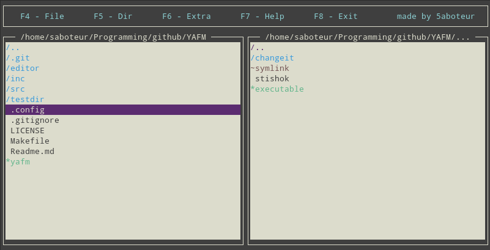
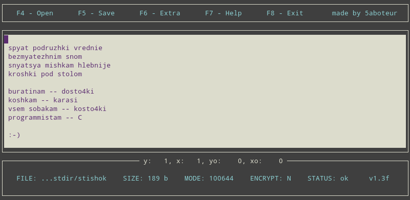
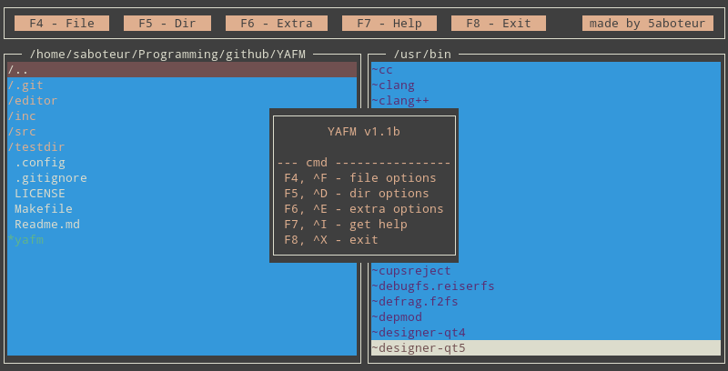

# YAFM

## Overview

YAFM (Yet Another File Manager) – is a file manager, built for education purposes. It's written in C language and uses ncurses library to provide the simple graphical user interface. YAFM was made in 2018 to pass the Eltex courses.

This is how the program might look after the first launch:

The manager uses built-in [YATE](https://github.com/5aboteur/yate) editor to edit _(sic!)_ files. When you click on a text file, YATE launches automatically and shows the content of it:

YAFM has 3 abstract sections. The upper one has all of YAFM features, such as file manipulations, extra options etc. Each option is accompanied with a function key and a shortcut. This is how, for example, the 'help' window looks like:

## Features

* An ability to create / update / delete / copy / paste files
* An ability to make and remove directories
* Editing files via YATE
* Four different themes

## Control keys & Shortcuts

| Key | Shortcut | Description     |
|-----|----------|-----------------|
|  F4 |  CTRL+F  | file options    |
|  –  |  CTRL+Q  | create file     |
|  –  |  CTRL+C  | copy file       |
|  –  |  CTRL+V  | paste file      |
|  –  |  CTRL+R  | remove file     |
|  F5 |  CTRL+D  | dir options     |
|  –  |  CTRL+W  | make dir        |
|  –  |  CTRL+K  | remove dir      |
|  F6 |  CTRL+E  | extra options   |
|  –  |  CTRL+G  | change theme    |
|  F7 |  CTRL+I  | get help        |
|  F8 |  CTRL+X  | exit            |
